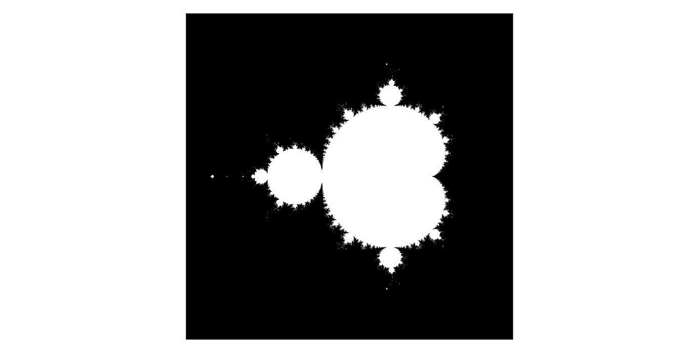
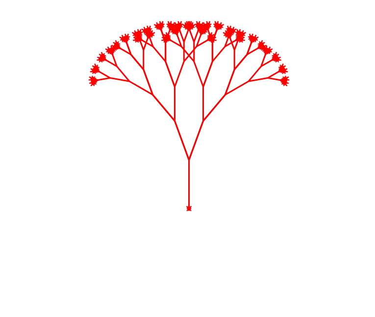

# Fractal Geometry

**START DATE**: April - 11 - 2020

This repo stores different fractal case studies used for learning recursion and visualization with `matplotlib` and `turtle`.

## Mandelbrot set

A Mandelbrot set is a set of points in the complex plane such that the Julia set is:

1. connected and
2. not computable

### TODO

- capture regions of interest
  - seahorse valley
  - elephant valley

## fractal trees

A tree where each subsequent branch is smaller but keeps the same overall symmetry of right and left branches.

### TODO

- change turtle shape to a Mandelbrot set
- as length reduces so should the width to make it look more like a tree